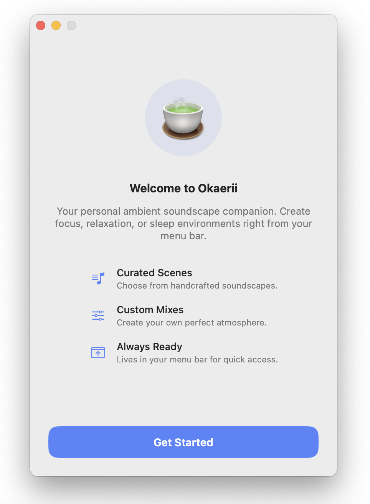
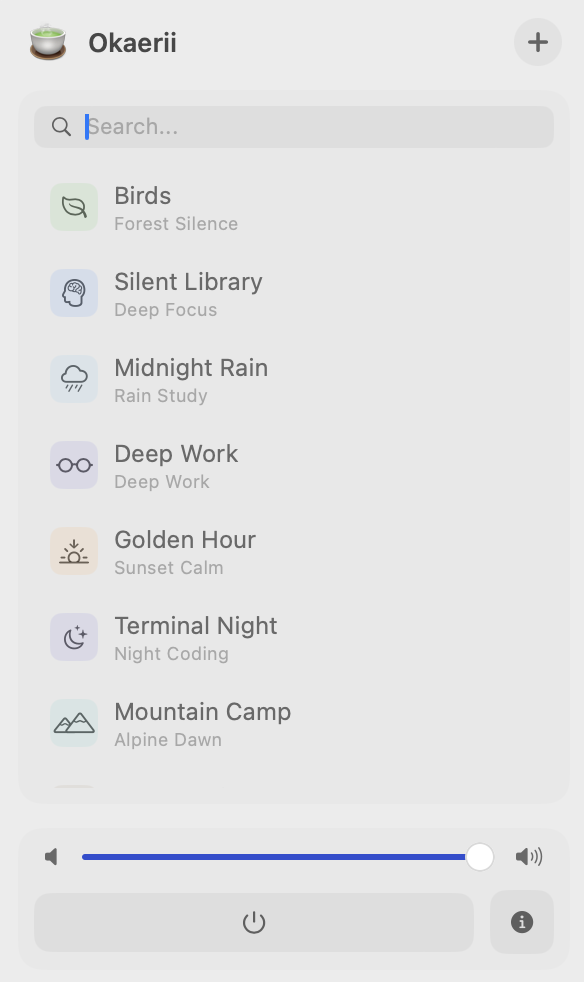
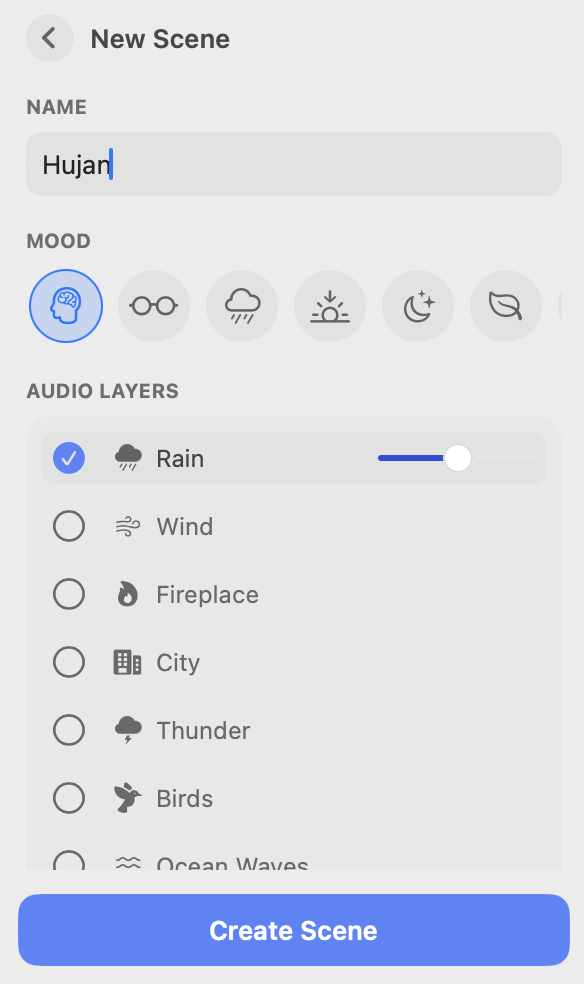

# Okaerii 🍵

> Your personal ambient soundscape companion. Create focus, relaxation, or sleep environments right from your menu bar.

<p align="center">
  <a href="https://github.com/ibidathoillah/Okaerii/releases/latest">
    
  </a>
  &nbsp;
  <a href="https://github.com/ibidathoillah/Okaerii/releases/download/v1.0.0/Okaerii.dmg">
    
  </a>
</p>

<p align="center">
  
</p>

<p align="center">
  
  &nbsp;&nbsp;
  
</p>

Okaerii (おかえり) is a minimalist, open-source macOS menu bar application designed to help you stay focused, relax, or drift off to sleep with high-quality ambient audio. It lives quietly in your menu bar, ready to transform your environment with a single click.

## Features

- **Menu Bar Native**: Runs entirely in the background with a lightweight footprint. Accessible via a simple `🍵` icon.
- **Curated Scenes**: Instantly switch between handcrafted soundscapes like "Deep Work", "Midnight Rain", and "Forest Zen".
- **Custom Mixes**: Create your own perfect atmosphere by mixing layers (Rain, Fire, Birds, Cafe, etc.) and adjusting individual volumes.
- **Gapless Looping**: Custom audio engine ensures seamless, infinite playback without jarring interruptions.
- **Minimalist UI**: A clean, distraction-free interface built with SwiftUI.

## Installation

### From Source

You can run Okaerii directly using Swift Package Manager:

```bash
git clone https://github.com/ibidathoillah/Okaerii.git
cd Okaerii
swift run
```

### Building the App

To create a standalone `.app` and `.dmg` installer, run the provided build script:

```bash
./scripts/build_installer.sh
```

This will generate `Okaerii.dmg` in the project root directory.

## Development

Okaerii is built using:
- **Swift 5.9+**
- **SwiftUI** for the user interface
- **AppKit** for window management and menu bar integration
- **AVFoundation** for high-performance audio mixing

### Requirements
- macOS 14.0 (Sonoma) or later
- Xcode 15+ (for development)

### Xcode Setup
1. Ensure you have [XcodeGen](https://github.com/yonaskolb/XcodeGen) installed (`brew install xcodegen`).
2. Run `xcodegen generate` in the project root.
3. Open `Okaerii.xcodeproj`.

## License

This project is licensed under the MIT License - see the [LICENSE](LICENSE) file for details.

## Author

Made with 🍵 by [Ibid Athoillah](https://github.com/ibidathoillah).
